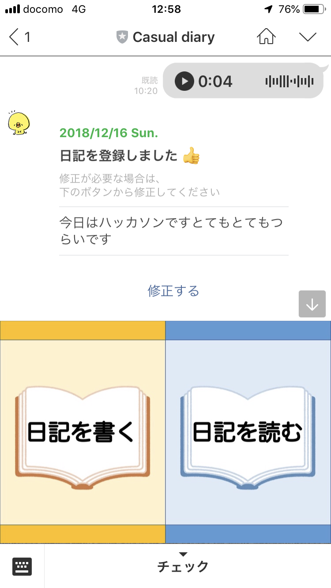
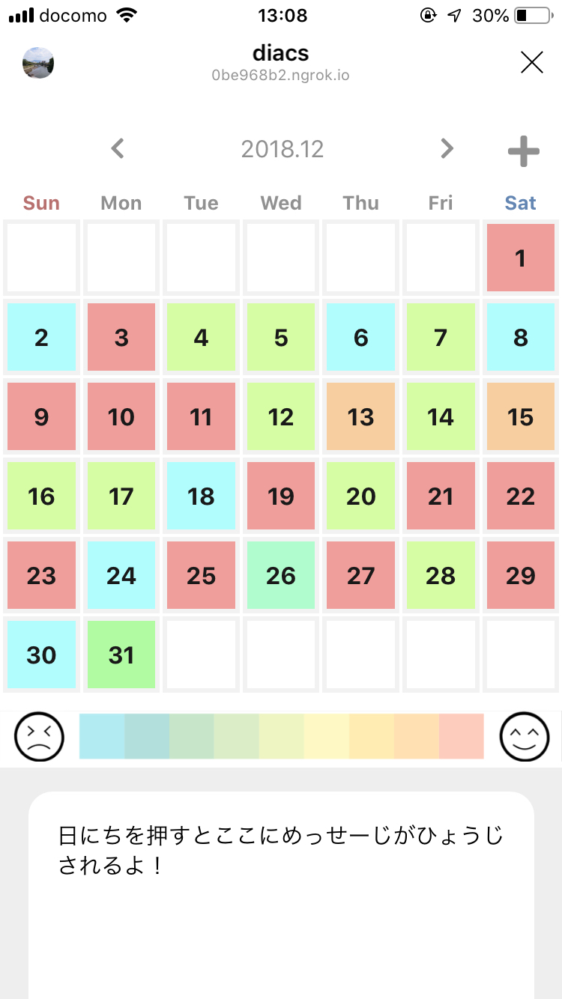

## ksec-line-diary-bot
[KOSENハッカソン feat.LINE](https://mashupawards.connpass.com/event/109314/) でつくったLINE BOTのChat/Cloud側のコード

## About
### 作品名
Casual diary

### 作品概要
Casual diaryは、LINE上で日記の記録・共有ができるプラットフォームです。

■ 課題と解決

1. 日記を手書き/手打ちするのは面倒 
　→ 音声認識APIを使うことで、今日あったことを話すだけで日記ができる！

2. そもそも、日記って見返さなくない？ 
　→ 感情分析APIを使うことで、ひと目で、「いつ、何があったのか」をなんとなく思い出せる

3. 遠くに住むおじいちゃん、おばあちゃんに気軽に「元気にしてるよ〜」と伝えたい 
　→ トークでリンクを送るだけで簡単に共有できる！

### 発表資料
- [PDF](about/presentation.pdf)

### スクリーンショット
|トーク画面|日記画面|
|---|---|
|||

### アーキテクチャ図
- https://www.draw.io/?lightbox=1&highlight=0000ff&edit=_blank&layers=1&nav=1&title=diary.xml#Uhttps%3A%2F%2Fdrive.google.com%2Fuc%3Fid%3D1DoGvK5VP6rdO7hJg3kF95bWJuI2k0kml%26export%3Ddownload

### Link
- https://protopedia.net/prototype/36d7534290610d9b7e9abed244dd2f28
